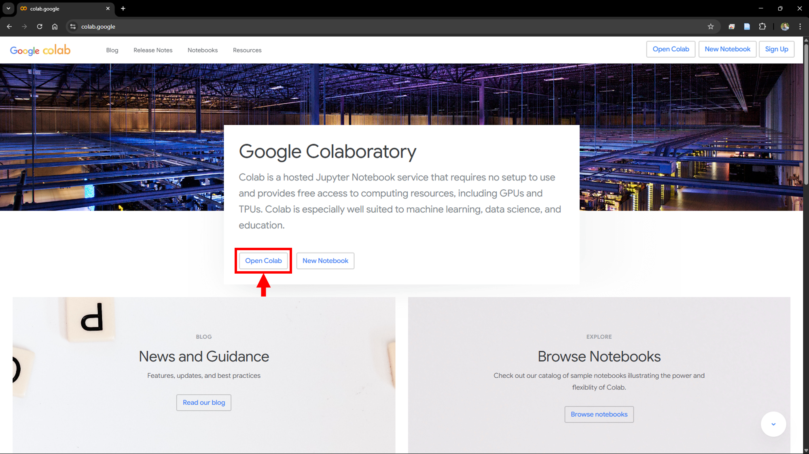
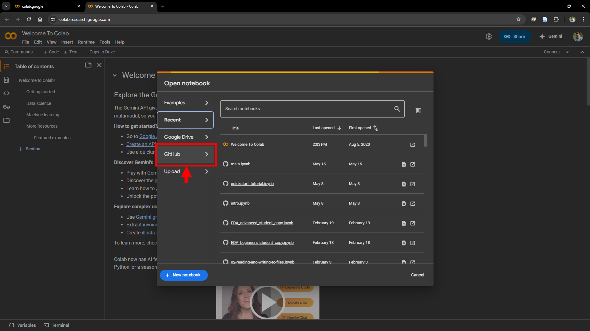
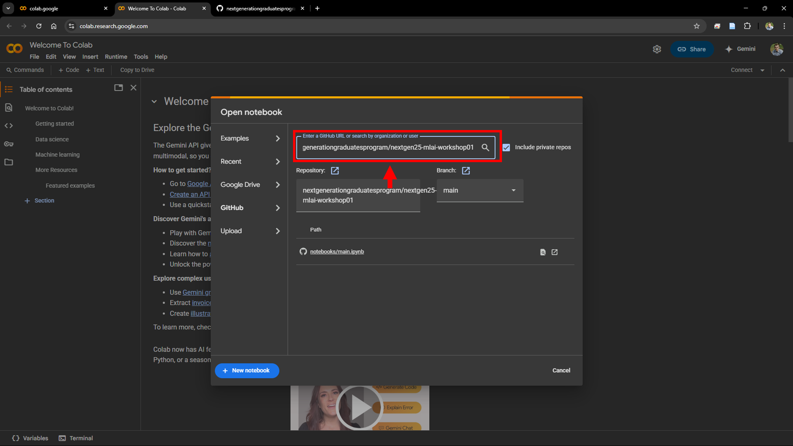
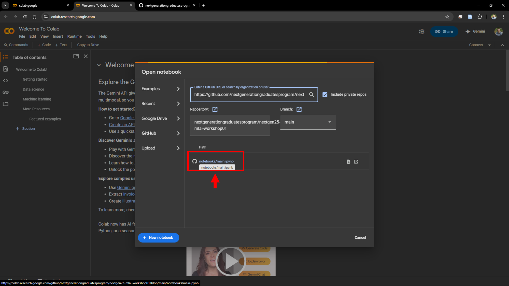

<h1>CSIRO NextGen25 Machine Learning Workshop #3</h1>

The objective of this workshop is to revisit and reinforce the concepts explored in workshops 1 and 2 in a different problem setting.

<h2>:wrench: Setup</h2> 

Access the [Google Colab](https://colab.google/) website and open the colab service as shown below.

    

Open a notebook from a GitHub repository as shown below.

    

Paste the URL to the GitHub repository for this workshop ([NextGen25 MLAI Workshop 03](https://github.com/nextgenerationgraduatesprogram/nextgen25-mlai-workshop03)) in the search field as shown below.

    

Lastly, launch the notebook to get started!

    

